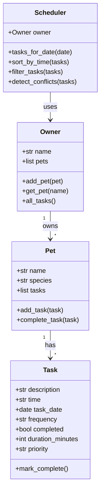

# PawPal+ (Module 2 Project)

You are building **PawPal+**, a Streamlit app that helps a pet owner plan care tasks for their pet.

## Scenario

A busy pet owner needs help staying consistent with pet care. They want an assistant that can:

- Track pet care tasks (walks, feeding, meds, enrichment, grooming, etc.)
- Consider constraints (time available, priority, owner preferences)
- Produce a daily plan and explain why it chose that plan

Your job is to design the system first (UML), then implement the logic in Python, then connect it to the Streamlit UI.

## What you will build

Your final app should:

- Let a user enter basic owner + pet info
- Let a user add/edit tasks (duration + priority at minimum)
- Generate a daily schedule/plan based on constraints and priorities
- Display the plan clearly (and ideally explain the reasoning)
- Include tests for the most important scheduling behaviors

## Getting started

### Setup

```bash
python -m venv .venv
source .venv/bin/activate  # Windows: .venv\Scripts\activate
pip install -r requirements.txt
```

### Suggested workflow

1. Read the scenario carefully and identify requirements and edge cases.
2. Draft a UML diagram (classes, attributes, methods, relationships).
3. Convert UML into Python class stubs (no logic yet).
4. Implement scheduling logic in small increments.
5. Add tests to verify key behaviors.
6. Connect your logic to the Streamlit UI in `app.py`.
7. Refine UML so it matches what you actually built.

## Architecture (UML — Mermaid)

The diagram below summarizes how the four main types work together. **Owner** aggregates **Pet**; each **Pet** owns many **Task** records; **Scheduler** reads from **Owner** to sort, filter, and check conflicts.



## Smarter scheduling

The logic layer (`pawpal_system.py`) includes:

- **Chronological sorting** — `Scheduler.sort_by_time()` orders tasks by clock time (`HH:MM`), using a small parser so strings sort as real times, not lexicographic accidents.
- **Filtering** — `filter_tasks()` can narrow by completion status and/or pet name for focused views in the CLI or Streamlit UI.
- **Recurring tasks** — When a **daily** or **weekly** task is completed via `Pet.complete_task()`, `Task.mark_complete()` appends the next dated instance to the same pet.
- **Conflict warnings** — `detect_conflicts()` flags when two or more tasks share the **exact same calendar date and start time** (any pet). The app shows these as warnings instead of blocking saves.

### Run the app

```bash
streamlit run app.py
```

### CLI demo

```bash
python3 main.py
```

## Features

| Feature | Description |
|--------|-------------|
| Multi-pet owner | One `Owner`, many `Pet` records; all tasks roll up for scheduling. |
| Task metadata | Time, date, duration, priority, frequency (`once` / `daily` / `weekly`). |
| Sorted daily view | See the day’s tasks in time order. |
| Filters | By pet and/or hide completed items (Streamlit + `filter_tasks`). |
| Recurrence | Completing daily/weekly tasks schedules the next occurrence automatically. |
| Conflict hints | Same date + same start time → warning strings for the UI or terminal. |
